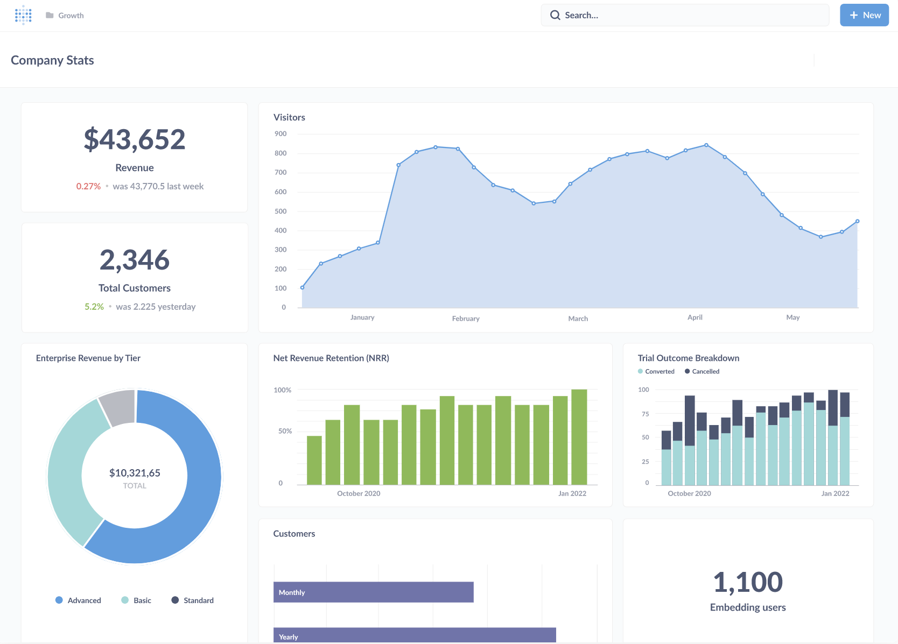

# Metabase

Metabase is the easy, open-source way for everyone in your company to ask questions and learn from data.



---

You will need to use WSL, if on windows. On Mac or Linux, you can skip this step and use bash.
Run these on Powershell to install WSL.

```bash
wsl --install
wsl --set-default-version 2
```

### Clone the repo

```bash
git clone https://github.com/REODigital/metabase-demo.git
cd ~/metabase-demo
```

### Install dependencies (Only for the first time per instance)

```bash
install nvm
curl -o- https://raw.githubusercontent.com/nvm-sh/nvm/v0.40.3/install.sh | bash
nvm install 22
nvm use 22
sudo apt update
sudo apt install openjdk-21-jdk -y
sudo apt install build-essential -y
curl -O https://download.clojure.org/install/linux-install-1.12.0.1488.sh
chmod +x linux-install-1.12.0.1488.sh
sudo ./linux-install-1.12.0.1488.sh
corepack enable
corepack prepare yarn@1.22.22 --activate
yarn install --ignore-scripts
./bin/i18n/build-translation-resources
./bin/build-drivers.sh
```

### Start the frontend in a WSL / Bash instance

```bash
yarn build-hot
```

### Start the backend in another WSL / Bash instance

```bash
clojure -M:run
```

### Preview the build @ http://localhost:3000

---

## Resources

### Clear DB and Local storage

Run these commands to clear data in local env, if you've created an account, want to clear DB, etc.

```bash
rm -rf target/cljs_dev/*
rm -rf node_modules/.cache
rm -rf resources/frontend_client/app/dist
rm -rf target/classes/frontend_client/app/dist
rm -rf node_modules/.cache
rm -f metabase.db.mv.db
rm -f metabase.db.trace.db
```

### Navigating to the assessment sections

- Click "Let's get started"
- For the language dropdown, upon selection of a language, the language on the page should NOT change until the user has committed by clicking the Next button.
- When keyboard focused on the language dropdown, you should navigate through the options using the up/down arrow keys, Tab moves focus to the next interactive element which is Next in this case, do not implement Enter on selection, only the Next button should be used.
- Fix visible keyboard focus on buttons by implementing a blue box style around the buttons and links and ensure there is a gap.
- Click Next to get to the next page.

###### Issue 2 + others:
- Fill in all the account credentials using test values.
- Click Next
- Keep the default radio button option
- Click Next
- Now we are in Add your data
- You will see a selection of databases.
- Type in say "my" and this should filter the list to only show MySQL. Hitting Tab should focus on MySQL but instead goes to "I'll add my data later". However, hitting down arrow key moves focus to the database since the element is implemented as role="option".
- Implement Tab key to focus on database options
- Add label to the search input field
- Make keyboard focus style the same thick box border with gap as in the button focus
